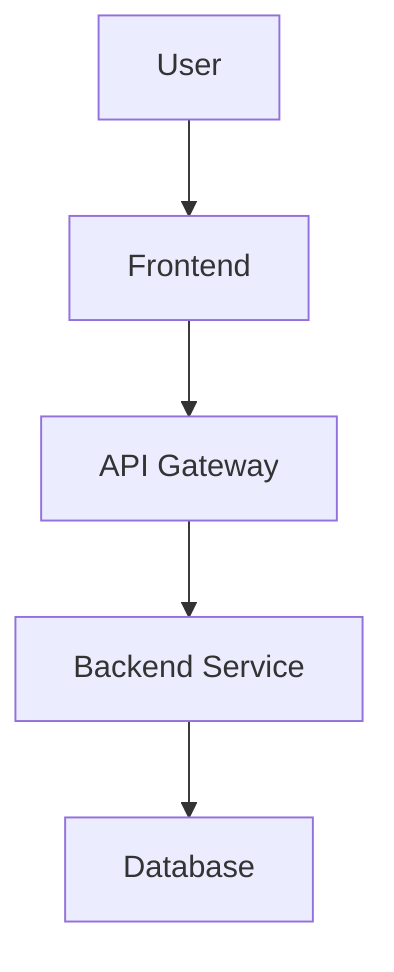
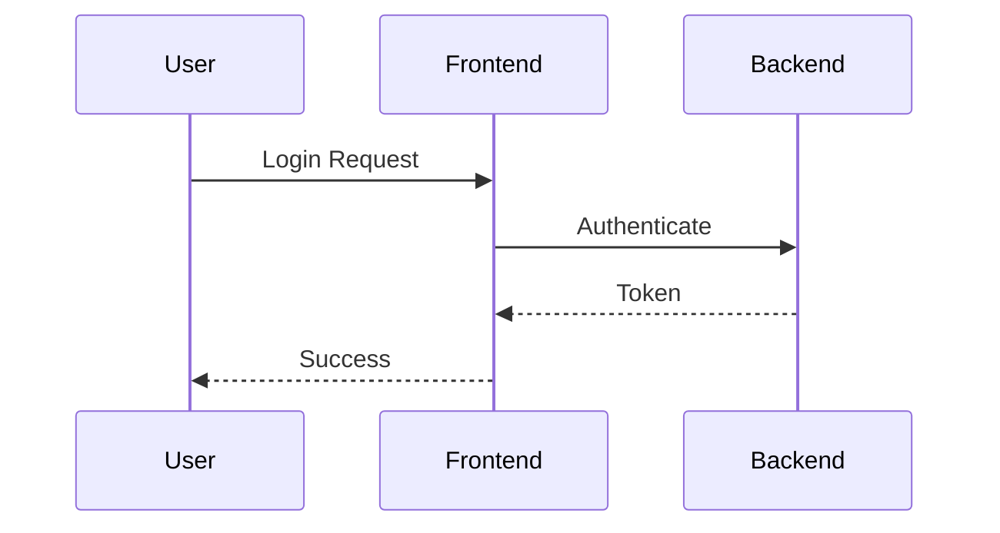

# Conflux
[](https://gdesouza.semaphoreci.com/projects/conflux)

A command-line tool to synchronize local markdown files to Confluence spaces with Mermaid.js diagram support.

## Features

- **Sync markdown files to Confluence pages** - Convert and upload your local documentation
- **Image attachment support** - Automatically upload and reference images from your markdown files
- **Mermaid.js diagram support** - Automatically convert or preserve mermaid diagrams in your documentation
- **Automatic directory page creation** - Creates organized parent pages with children macros for folder structures
- **Smart page hierarchy** - Maintains your local directory structure in Confluence
- **Create new pages or update existing ones** - Handles both new content and updates seamlessly
- **Children macro integration** - Automatically lists child pages in directory pages
- **Dry-run mode for testing** - Preview changes before making them
- **Configurable file exclusions** - Skip files you don't want to sync
- **Verbose logging** - Detailed output for debugging and monitoring
- **Proper page versioning** - Handles Confluence page version management automatically
- **Multi-project configuration** - Map multiple local doc trees to multiple Confluence spaces and select at runtime with `--project`

## Mermaid.js Diagram Support

Conflux supports automatic processing of Mermaid.js diagrams in your markdown files. When mermaid code blocks are detected, you can choose to either preserve them as syntax-highlighted code blocks in Confluence or convert them to images.

### Setup

1. **Install Mermaid CLI** (for image conversion):
   ```bash
   npm install -g @mermaid-js/mermaid-cli
   ```

2. **Configure mermaid support** in your `config.yaml`:
   ```yaml
   mermaid:
     mode: "convert-to-image"  # Options: "preserve" or "convert-to-image"
     format: "png"             # Options: "png", "svg", "pdf"
     theme: "default"          # Options: "default", "dark", "forest", "neutral"
   ```

### Processing Modes

**Preserve Mode** (`mode: "preserve"`):
- Keeps mermaid diagrams as syntax-highlighted code blocks in Confluence
- No external dependencies required
- Diagrams remain editable in Confluence

**Convert-to-Image Mode** (`mode: "convert-to-image"`):
- Converts mermaid diagrams to images (PNG, SVG, or PDF)
- Images are uploaded as Confluence attachments
- Requires `@mermaid-js/mermaid-cli` to be installed
- Provides better visual presentation

### Example Usage

Create a markdown file with mermaid diagrams:

````markdown
# System Architecture



## Process Flow


````

When synced to Confluence:
- **Preserve mode**: Diagrams appear as formatted code blocks
- **Convert-to-image mode**: Diagrams are rendered as images and embedded in the page

### Dependency Checking

Conflux automatically checks for mermaid CLI availability:
- If `mmdc` is not found and mode is "convert-to-image", it falls back to "preserve" mode
- Use `conflux sync -verbose` to see dependency check results
- Graceful fallback ensures sync operations continue even if CLI is unavailable

## Image Attachment Support

Conflux automatically detects and uploads image files referenced in your markdown documentation, making them available as Confluence page attachments.

### Supported Image Formats

By default, Conflux supports the following image formats:
- **PNG** - Portable Network Graphics
- **JPG/JPEG** - Joint Photographic Experts Group
- **GIF** - Graphics Interchange Format
- **SVG** - Scalable Vector Graphics
- **WEBP** - Modern web-optimized format

### How It Works

1. **Automatic Detection**: Conflux scans your markdown for image references using standard markdown syntax: ``
2. **Path Resolution**: Both relative and absolute image paths are supported
3. **Validation**: Images are checked for existence, file size limits, and supported formats
4. **Upload**: Valid images are uploaded as Confluence page attachments
5. **Reference Replacement**: Markdown image syntax is replaced with Confluence image macros

### Configuration

Configure image processing in your `config.yaml`:

```yaml
images:
  supported_formats: ["png", "jpg", "jpeg", "gif", "svg", "webp"]
  max_file_size: 10485760  # 10MB in bytes
  resize_large: false      # Future feature for image resizing
  max_width: 1200          # Max width for future resizing feature
  max_height: 800          # Max height for future resizing feature
```

### Example Usage

Create a markdown file with image references:

```markdown
# Project Architecture

Here's our system architecture:


## Component Diagram


## Screenshots


```

When synced to Confluence:
- Images are uploaded as page attachments
- Markdown image syntax is replaced with Confluence image macros
- Images display properly in Confluence pages
- Alt text is preserved for accessibility

### Error Handling

Conflux handles image processing errors gracefully:
- **Missing files**: Logs warnings but continues sync operation
- **Unsupported formats**: Skips invalid images and reports in logs
- **Size limits**: Reports files that exceed configured limits
- **Upload failures**: Continues with other images and page content

Use `conflux sync -verbose` to see detailed image processing information.

## Installation

### From Source

```bash
# Build locally
make build

# Install to /usr/local/bin (requires sudo)
make install

# Uninstall
make uninstall
```

### Manual Build

```bash
go build -o conflux ./cmd/conflux
```

## How It Works

### Directory Structure Mapping

Conflux automatically creates a hierarchical structure in Confluence that mirrors your local directory organization:

```
docs/
├── README.md                    → "Docs" page (directory page)
├── getting-started.md           → "Getting Started" page
├── api/
│   ├── authentication.md       → "Api" page (directory page)
│   └── endpoints.md            → "Authentication" & "Endpoints" pages
└── tutorials/
    ├── basic-usage.md          → "Tutorials" page (directory page)
    └── advanced-features.md    → "Basic Usage" & "Advanced Features" pages
```

### Automatic Directory Pages

For each directory containing markdown files, Conflux creates a corresponding "directory page" in Confluence that:

- **Serves as a parent page** for all files in that directory
- **Automatically lists child pages** using Confluence's children macro
- **Updates dynamically** when child pages are added, removed, or modified
- **Maintains proper hierarchy** with parent-child relationships
- **Includes attribution** with a link back to this project

Example directory page content:
```
# Api Documentation

This section contains documentation for api. The pages below are automatically 
listed and updated whenever child pages are added or modified.

## Contents
[Children macro - automatically shows: Authentication, Endpoints]

*This page was automatically created by Conflux to organize documentation hierarchy.*
```

## Configuration

Create a `config.yaml` file (single-project example):

```yaml
confluence:
  base_url: "https://yourcompany.atlassian.net/wiki"
  username: "your.email@company.com" 
  api_token: "your-api-token-here"
  space_key: "DOCS"

local:
  markdown_dir: "./docs"
  exclude:
    - "README.md"
    - "*.tmp.md"

# Optional: Image attachment support
images:
  supported_formats: ["png", "jpg", "jpeg", "gif", "svg", "webp"]
  max_file_size: 10485760
  resize_large: false
  max_width: 1200
  max_height: 800

# Optional: Mermaid.js diagram support
mermaid:
  mode: "convert-to-image"
  format: "png"
  cli_path: "mmdc"
  theme: "default"
```

### Multi-Project Configuration

You can manage multiple documentation roots and Confluence spaces using the `projects` section. When `projects` are defined the top-level `confluence.space_key` becomes optional. The first project acts as the default if no `--project` is specified and no explicit space is provided.

```yaml
confluence:
  base_url: "https://yourcompany.atlassian.net/wiki"
  username: "your.email@company.com"
  api_token: "your-api-token-here"

projects:
  - name: "core"
    space_key: "CORE"
    local:
      markdown_dir: "./core-docs"
      exclude: ["README.md"]
  - name: "platform"
    space_key: "PLAT"
    local:
      markdown_dir: "./platform-docs"
      exclude: ["draft-*", "internal/*"]

images:
  supported_formats: ["png", "jpg", "jpeg", "gif", "svg", "webp"]

mermaid:
  mode: "preserve"
```

#### Space Resolution Precedence
1. Explicit CLI `--space` flag
2. Selected project via `--project <name>`
3. Default project (first in list) if any
4. Legacy top-level `confluence.space_key`

#### Selecting a Project
```bash
# Sync using the 'platform' project (infer space + docs path)
conflux sync --project platform

# List pages for 'core' without specifying --space
conflux list-pages --project core

# Fetch a page with project inference
conflux get-page --project core --page "Getting Started"
```

#### Listing Projects
```bash
conflux projects
conflux projects --show-exclude
```
Outputs all configured projects, marking the first one as the default.

## Usage

### Sync Command (Default)

```bash
# Basic usage - sync current directory with default config
conflux

# Specify documents directory via CLI (overrides config & project local path)
conflux sync -docs ./documentation

# Use custom config file
conflux -config /path/to/config.yaml

# Multi-project: choose project (space + local docs inferred)
conflux sync --project core

# Dry run (no changes made)
conflux sync -dry-run -verbose

# Complex example overriding inferred docs dir
conflux sync --project platform -docs ./overrides/platform -dry-run -verbose
```

### List Pages Command
```bash
# List all pages in a space
conflux list-pages -space DOCS

# List pages under a specific parent page
conflux list-pages -space DOCS -parent "API Documentation"

# Use project inference (no --space required)
conflux list-pages --project core
```

### Get Page Command
```bash
# Fetch a page by numeric ID (storage format by default)
conflux get-page -space DOCS -page 123456789

# Fetch by title
conflux get-page -space DOCS -page "Getting Started"

# Use project inference
conflux get-page --project core --page "Getting Started"

# Output rendered HTML view
conflux get-page -space DOCS -page 123456789 -format html

# Convert to Markdown
conflux get-page -space DOCS -page 123456789 -format markdown
```
Supported formats:
- storage (default) – raw Confluence storage format XML/HTML
- html – rendered page HTML (falls back to storage if view not available)
- markdown – converts rendered HTML (or storage) to Markdown

### Upload Command
```bash
# Create a new page from a single markdown file
conflux upload -file ./docs/intro.md -space DOCS

# Update an existing page (matched by top-level markdown heading)
conflux upload -f ./docs/intro.md -space DOCS

# Specify a parent page by numeric ID
conflux upload -f ./docs/feature.md -space DOCS -parent 123456789

# Or specify parent by title (resolved in the target space)
conflux upload -f ./docs/advanced/optimizer.md -space DOCS -parent "Architecture"

# Use project inference (space comes from project config)
conflux upload -f ./docs/core/overview.md --project core
```
Behavior:
- Determines the Confluence page title from the first level-1 markdown heading (`# Title`).
- If a page with that title already exists in the resolved space it is updated; otherwise it is created.
- Parent page may be provided as a numeric ID or as a title (looked up in the target space).
- Space resolution precedence matches other commands: `--space` > `--project` > default project > legacy top-level `space_key`.

Current limitations:
- The `upload` command currently performs a basic markdown-to-Confluence storage conversion and does NOT yet run the second-pass processing for Mermaid diagrams or image attachment uploads that `sync` performs. These enhancements can be added in a future iteration (e.g., reusing the post-processing pipeline from sync).

Flags:
- `--file` / `-f` (required) – Path to a single markdown file.
- `--space` / `-s` – Confluence space key (optional if `--project` supplied or default project provides one).
- `--project` / `-P` – Project name defined in config to infer space.
- `--parent` / `-p` – Optional parent page title or numeric ID.

### Inspect Command
```bash
# Space overview
conflux inspect -space DOCS

# Inspect a page by title
conflux inspect -space DOCS -page "Architecture"

# With project inference
conflux inspect --project core -page "Architecture"
```

### CLI Commands

- `sync` - Sync local markdown files to Confluence (default command)
- `list-pages` - List page hierarchy from a Confluence space
- `get-page` - Fetch and display a page's content by ID or title (storage, html, or markdown formats)
- `inspect` - Inspect page hierarchy and relationships
- `upload` - Create or update a single markdown file as a Confluence page
- `projects` - List configured projects (multi-project mode)
- `configure` - Create or edit the configuration file (interactive or scripted)

### Configure Command

The `configure` command helps you create or update a `config.yaml` either interactively (guided prompts) or non-interactively for automation (CI/CD, scripting).

Interactive mode (default when no non-interactive flags provided):
```bash
conflux configure
```
Provides prompts for Confluence credentials, optional multi-project setup, Mermaid, and Images settings. Existing values are shown as defaults if a config already exists.

Non-interactive scripted usage:
```bash
# Create or update config without prompts
conflux configure \
  --non-interactive --yes \
  --set confluence.base_url=https://your.atlassian.net/wiki \
  --set confluence.username=you@company.com \
  --set confluence.api_token=$ATLASSIAN_TOKEN \
  --set mermaid.mode=preserve \
  --add-project "name=core,space_key=CORE,markdown_dir=./core-docs" \
  --add-project "name=platform,space_key=PLAT,markdown_dir=./platform-docs,exclude=README.md" \
  --config ./config.yaml
```

Print resulting YAML instead of writing (preview / generate for pipelines):
```bash
conflux configure --non-interactive --yes \
  --set confluence.base_url=https://your.atlassian.net/wiki \
  --set confluence.username=ci-bot \
  --set confluence.api_token=$ATLASSIAN_TOKEN \
  --add-project "name=docs,space_key=DOCS,markdown_dir=./docs" \
  --print
```

Remove or replace projects:
```bash
# Replace existing project definition (same name overwrites)
conflux configure --non-interactive --yes \
  --add-project "name=docs,space_key=DOCS,markdown_dir=./documentation" \
  --config config.yaml

# Remove a project
conflux configure --non-interactive --yes \
  --remove-project docs \
  --config config.yaml
```

Supported `--set` keys (dotted paths):
- confluence.base_url, confluence.username, confluence.api_token, confluence.space_key
- local.markdown_dir, local.exclude (comma list)
- mermaid.mode, mermaid.format, mermaid.cli_path, mermaid.theme, mermaid.width, mermaid.height, mermaid.scale
- images.supported_formats (comma list), images.max_file_size, images.resize_large, images.max_width, images.max_height

Notes:
- When `projects` are defined, top-level `confluence.space_key` becomes optional (space inferred by `--project`).
- `--yes` auto-confirms saving (otherwise a confirmation prompt appears in interactive mode).
- `--print` skips writing the file—useful for generating config in CI or diffing.

### CLI Flags

**Global Flags:**
- `-config` / `--config` - Path to configuration file (default: `config.yaml` or fallback to `~/.config/conflux/config.yaml`)
- `-verbose` / `-v` - Enable detailed logging output
- `-help` - Show usage information

**Sync Command Flags:**
- `-docs` - Path to markdown documents directory (overrides config/project)
- `-space` - Confluence space key (overrides project selection)
- `-project` / `-P` - Project name to select (infers space & docs)
- `-dry-run` - Preview changes without syncing to Confluence

**List-Pages Command Flags:**
- `-space` - Confluence space key (optional if `--project` supplied)
- `-parent` - Parent page title to start hierarchy from (optional)
- `-project` / `-P` - Project name to infer space

**Get-Page Command Flags:**
- `-space` - Confluence space key (optional if `--project` supplied)
- `-project` / `-P` - Project name to infer space
- `-page` - Page ID or title (required)
- `-format` - Output format: `storage` (default), `html`, or `markdown`

**Upload Command Flags:**
- `-file` / `-f` - Path to markdown file (required)
- `-space` / `-s` - Confluence space key (optional if `--project` supplied)
- `-project` / `-P` - Project name to infer space
- `-parent` / `-p` - Parent page title or numeric ID (optional)

**Inspect Command Flags:**
- `-space` - Confluence space key (optional if `--project` supplied)
- `-project` / `-P` - Project name to infer space
- `-page` - Page ID or title to start inspection (optional)
- `-details` - Show detailed page info

**Projects Command Flags:**
- `--show-exclude` - Include exclude patterns for each project

**Note**: The `-docs` flag overrides any `local.markdown_dir` from a project or top-level config.

## Troubleshooting

### Directory Pages Not Updating

If you notice that directory pages aren't showing updated children macro content:

1. **Delete and recreate**: In earlier versions, directory pages weren't updated automatically. Delete the directory pages in Confluence and run the sync again.
2. **Check permissions**: Ensure your API token has permission to update pages in the space.
3. **Use dry-run**: Test with `conflux sync -dry-run -verbose` to see what changes would be made.

### Children Macro Not Working

The children macro requires:
- **Proper parent-child relationships** - Conflux automatically sets these up
- **Valid Confluence space** - Make sure your space exists and is accessible
- **Appropriate permissions** - Your API token needs page creation/update rights

### Images Not Uploading or Displaying

If images in your markdown aren't being uploaded or displayed correctly:

1. **Check file paths**: Ensure image paths in your markdown are correct relative to the markdown file
   ```markdown
     # Relative to markdown file location
     # Absolute path
   ```
2. **Verify file formats**: Ensure images use supported formats
   - Supported: PNG, JPG, JPEG, GIF, SVG, WEBP
   - Check configuration in `config.yaml` under `images.supported_formats`
3. **Check file sizes**: Large files may be rejected
   - Default limit: 10MB
   - Configure in `config.yaml`: `images.max_file_size`
4. **Review permissions**: Ensure your API token can upload attachments
   - Confluence admin permissions may be required for file uploads
5. **Use verbose logging**: See detailed image processing information
   ```bash
   conflux sync -verbose -dry-run  # See what images are detected
   ```

### Mermaid Diagrams Not Converting

If mermaid diagrams aren't being converted to images:

1. **Check CLI installation**: Ensure `@mermaid-js/mermaid-cli` is installed globally
   ```bash
   npm install -g @mermaid-js/mermaid-cli
   mmdc --version  # Should show version number
   ```
2. **Verify configuration**: Check your `config.yaml` has correct mermaid settings
   ```yaml
   mermaid:
     mode: "convert-to-image"
     format: "png"
   ```
3. **Check dependencies**: Use verbose mode to see dependency check results
   ```bash
   conflux sync -verbose -dry-run
   ```
4. **Fallback behavior**: If CLI is unavailable, Conflux automatically falls back to preserve mode

### Debug Output

Use the verbose flag (`-v` or `-verbose`) to see detailed information about:
- Which pages are being created or updated
- Directory page content generation
- API requests and responses
- Children macro detection and processing
- Mermaid diagram detection and conversion
- Dependency checks and fallback decisions

```bash
# Example with full debug output
conflux sync -docs ./documentation -config prod.yaml -dry-run -verbose
```

## Getting a Confluence API Token

1. Go to https://id.atlassian.com/manage/api-tokens
2. Click "Create API token"
3. Give it a name and copy the generated token
4. Use your email and the token for authentication

## Recent Improvements

### v1.3.0 (Latest)
- **✅ Upload command** - Added `upload` for quickly creating/updating a single markdown file as a Confluence page
- **✅ Image attachment support** - Automatically detect and upload images referenced in markdown files
  - **Automatic detection**: Finds `` syntax in markdown content
  - **Multiple formats**: Support for PNG, JPG, JPEG, GIF, SVG, and WEBP images
  - **Path resolution**: Handles both relative and absolute image paths
  - **File validation**: Checks for file existence, size limits, and supported formats
  - **Graceful error handling**: Continues sync operation even when some images fail
- **✅ Enhanced markdown processing** - Extended parser to handle image references alongside mermaid diagrams
- **✅ Configurable image processing** - File size limits, supported formats, and future resizing options
- **✅ Improved sync logic** - Post-processing now handles both images and mermaid diagrams efficiently
- **✅ Comprehensive image validation** - Built-in checks for file existence, formats, and size limits
- **✅ Multi-project configuration** - Added `projects` section + `--project` flag, project listing command, and space inference precedence

### v1.2.0
- **✅ Mermaid.js diagram support** - Automatically process mermaid diagrams with two modes:
  - **Preserve mode**: Keep diagrams as syntax-highlighted code blocks
  - **Convert-to-image mode**: Convert to PNG/SVG/PDF and upload as attachments
- **✅ Enhanced markdown processing** - Extended parser to detect and handle mermaid code blocks
- **✅ Confluence attachment support** - Added API methods for uploading and managing attachments
- **✅ Dependency checking** - Automatic detection of mermaid CLI availability with graceful fallbacks
- **✅ Configurable mermaid themes** - Support for default, dark, forest, and neutral themes
- **✅ Multiple output formats** - PNG, SVG, and PDF support for converted diagrams
- **✅ Security improvements** - Upgraded from MD5 to SHA256 for file hashing

### v1.1.0
- **✅ Fixed children macro rendering** - Directory pages now properly display child page lists
- **✅ Enhanced directory page updates** - Existing directory pages are now updated with new content
- **✅ Simplified children macro** - Improved compatibility with Confluence Cloud
- **✅ Better error handling** - More robust page version management and API error handling
- **✅ Enhanced debug logging** - Comprehensive debugging output for troubleshooting
- **✅ Project attribution** - Directory pages now include a link back to this GitHub repository

### Key Bug Fixes
- Directory pages are now properly updated when they already exist (previously they were skipped)
- Children macro uses optimized parameters for better Confluence Cloud compatibility
- Fixed logger initialization issues that prevented debug output
- Improved Storage Format XML structure for Confluence API compatibility
- Enhanced security with SHA256 hashing instead of MD5
- Improved error handling and temp file cleanup in mermaid processing

## Development

### Session Summaries

Development session summaries are maintained in [`docs/sessions/`](docs/sessions/) to provide context continuity between development sessions. These summaries document:

- Feature implementation details and architectural decisions
- Key technical insights and lessons learned  
- Implementation approach and rationale
- Files modified and their purposes
- Test coverage and validation approach

This helps maintain context for future development work and provides valuable historical information about the project's evolution.

### Contributing

When contributing to this project:
1. Follow the existing code structure and patterns
2. Add comprehensive tests for new features
3. Update documentation (README, session summaries)
4. Use the session summary template for significant changes

## License

MIT
