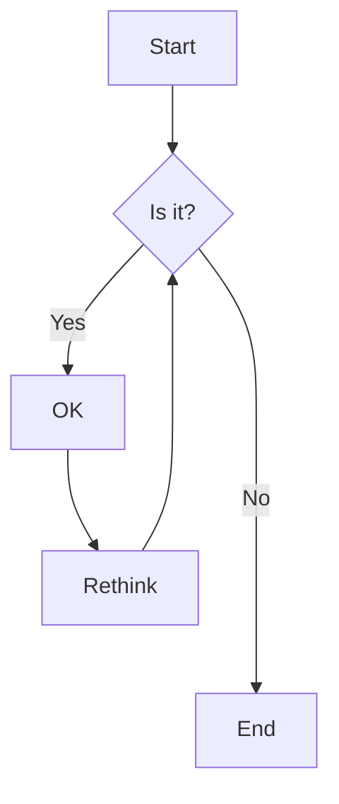
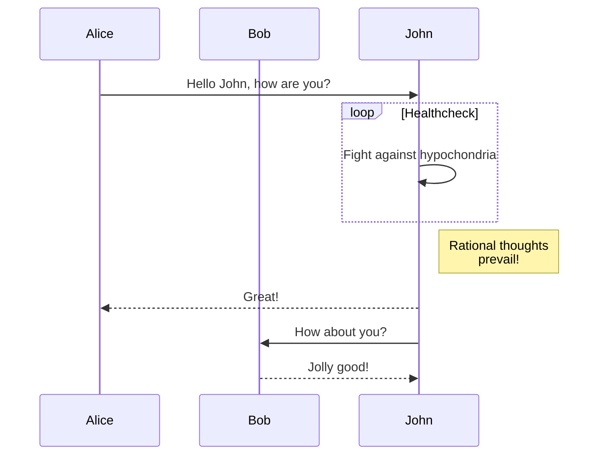
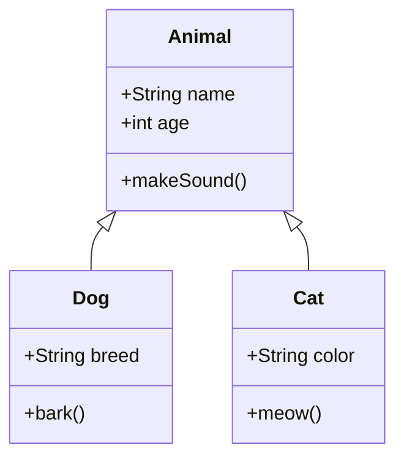

# Mermaid Diagram Test

This document contains various mermaid diagrams to test the integration.

## Flowchart Example

Here's a simple flowchart:



## Sequence Diagram

This shows a sequence diagram:



## Class Diagram

Here's a class diagram:



## Regular Code Block

This is a regular code block (not mermaid):

```javascript
function hello() {
    console.log("Hello World!");
}
```

## Text Content

Regular markdown text should be processed normally, with **bold** and *italic* formatting preserved.